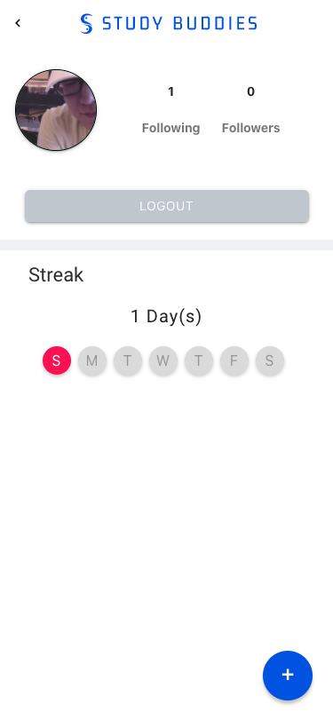
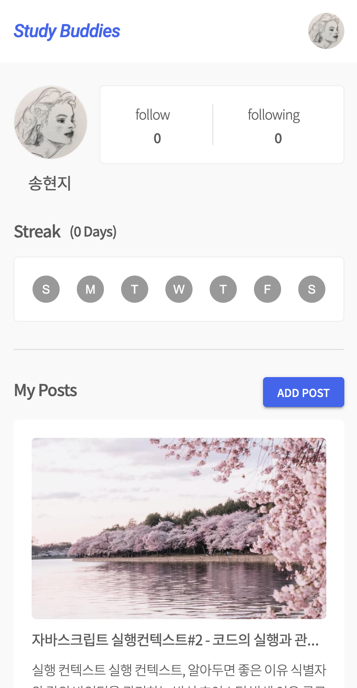
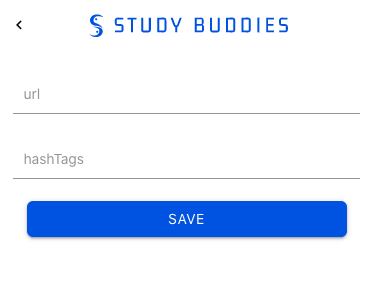
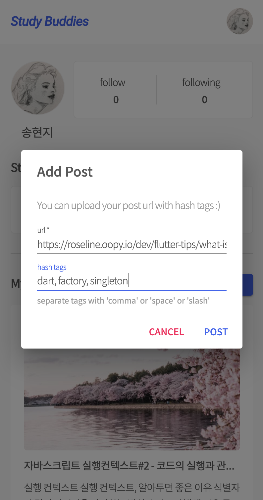
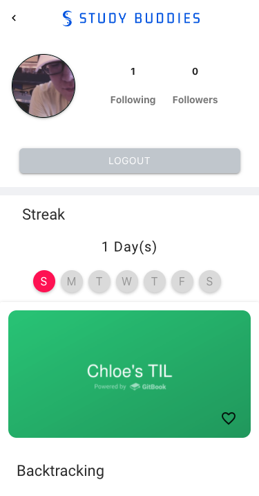
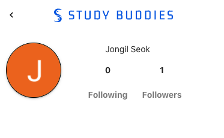
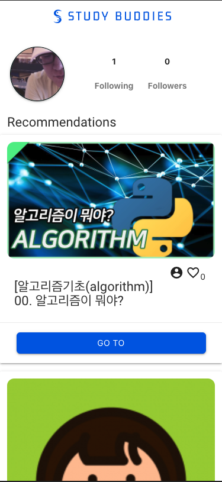
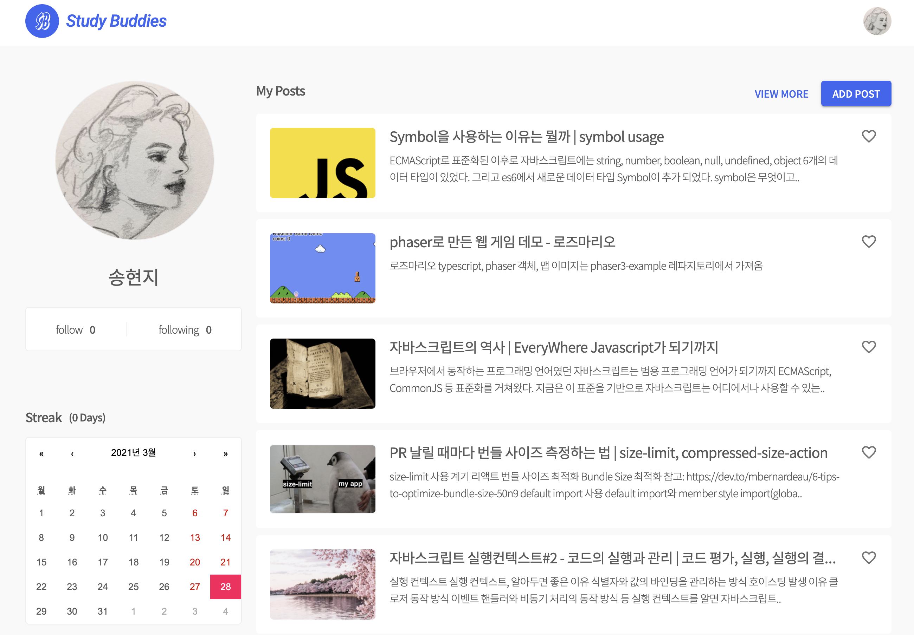

# study buddies

[Korean README.md is here!](https://github.com/roseline124/study-buddies/blob/dev/README.kr.md)

## add submodules

This repository consists of two submodules.

- [server](https://github.com/roseline124/study-buddies-server)
- [client](https://github.com/roseline124/study-buddies-client)

Run command below to add all submodules at once.

```
git clone --recurse-submodules git@github.com:roseline124/study-buddies.git
or
git clone --recurse-submodules https://github.com/roseline124/study-buddies.git
```

To give submodule name or path, run command below.
don't forget trailing slash after path.

```
git submodule add --name {name} {repository-url} {path}/

like this

git submodule add --name server https://github.com/roseline124/study-buddies-server.git server/
git submodule add --name client https://github.com/roseline124/study-buddies-client.git client/
```

## development

- typescript
- server: [apollo-server](https://www.apollographql.com/docs/apollo-server/), `node`, `sequelize`
- client: [apollo-client](https://www.apollographql.com/docs/react), `react`, `materializecss`
- database: mysql (AWS RDS)
- deployment: via [ainize](https://ainize.ai)

## main features

**main features**
`Study Buddies` counts consecutive study days called `streak` when user upload post every day, and recommends other users' posts based on user's posts.

We added 'like' and 'follow' features to notice popular post.
It is expected that it will product training courses by designating 'popular posts' and categories as featured in the future.

**effectiveness**
User can set next study goal via recommended posts and stack a lot of own education contents by posting steadily. user can be motivated to study every day.

**user experience**
User can sign in comfortably with google login.
`Study Buddies` extracts post data from `opengraph tag` via url, so user nothing to do except of putting url.

### profile




### upload content link




### read contents & streak (consecutive study days)



### follow



### recommendation



